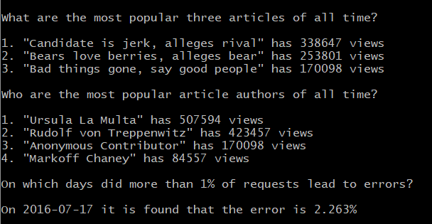

# Project 3: Log Analysis
### by Ganesh M

Build an internal reporting tool project, part of the Udacity [Full Stack Web Developer Nanodegree](https://in.udacity.com/course/full-stack-web-developer-nanodegree--nd004).).

## Project contents

This project consists for the following files:

* LogAnalysis.png - output screenshot
* newsdata.py - main Python script to run.
* newsdata.zip - database file (Udacity supplied)

## How to Run Project

* Install Python3, Vagrant and VirtualBox.

* Clone this repository

* Launch Vagrant VM by running vagrant up, you can the log in with vagrant ssh

* Unzip newsdata.zip

* Setup Database, Loading the data use the following command
    ```sh
    psql -d news -f newsdata.sql;
    ```

* To execute the program, run
    ```sh
    python newsdata.py
    ```

Output : 
-------------

